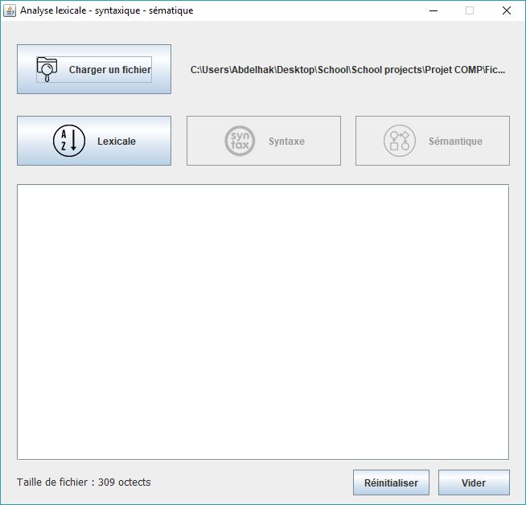
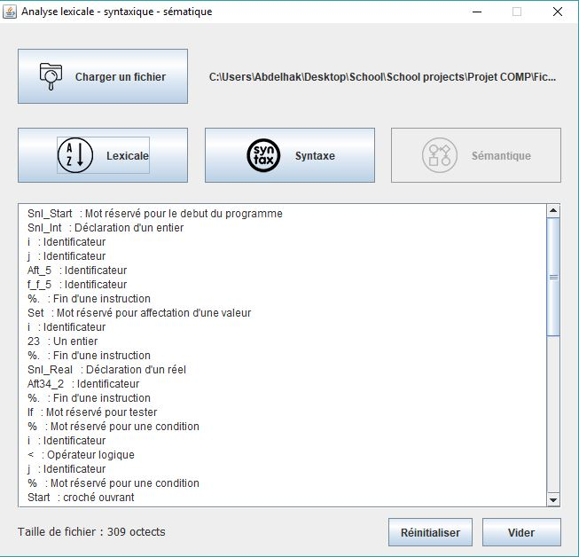
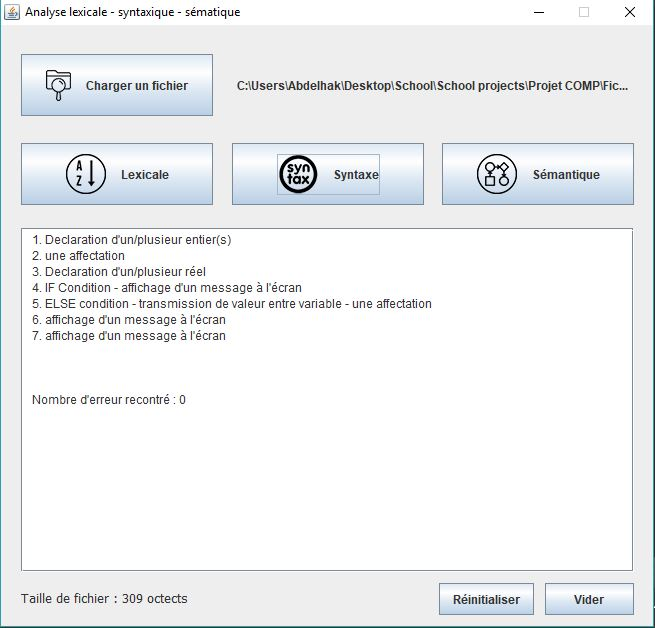
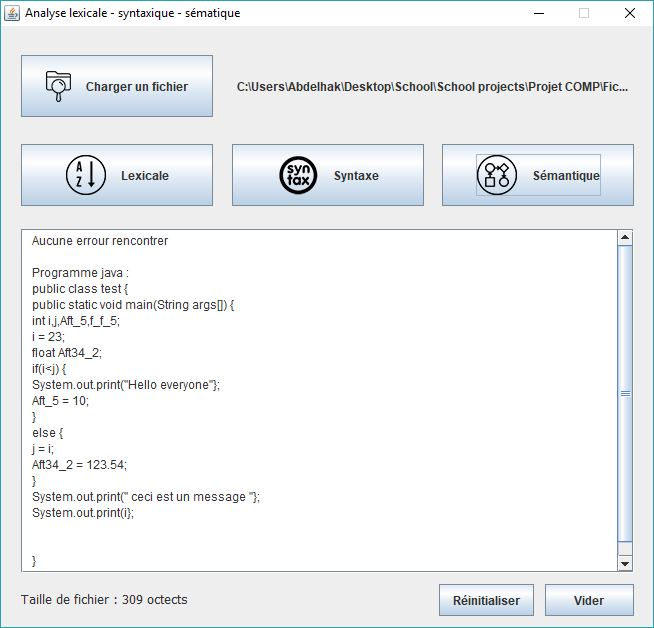

# snailCompiler
A lexical, syntaxic and semantique analyser for a hypothetical programming language called Snail

## Programming language sample:
```javascript
Snl_Start
Snl_Int i,j,Aft_5,f_f_5 %.
Set i 23 %.
Snl_Real Aft34_2 %.
If % i<j %.
 	Start
		Snl_Put "Hello everyone" %.
		Set Aft_5 10 %.
	Finish
Else
	Start
		Get j from i %.
		Set Aft34_2   123.54 %.
	Finish
Snl_Put " ceci est un message " %.
Snl_Put i %.
%.. ceci est un commentaire
Snl_Close
```

## Screenshots




